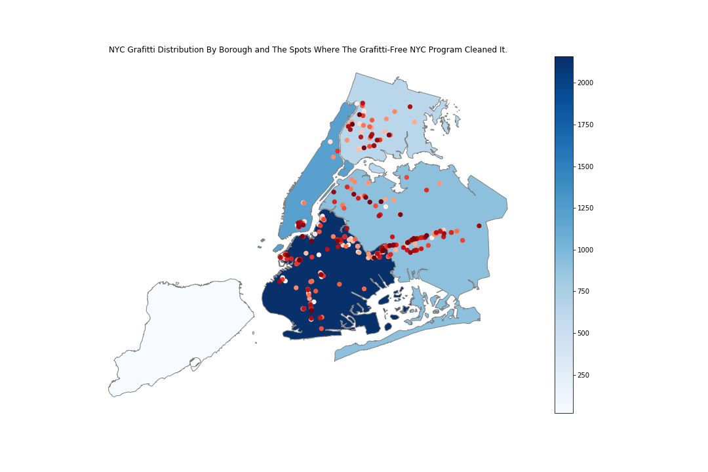

##tn1050 plot

Your plot is coherent in terms of where the spots are. However, it might be better and more accurate if the spots are smaller, so to pinpoint the locations better.

NYC Graffiti Distribution by borough is fine if that's the only data you got, but if they have PUMA data for graffiti, it might be better to show the distribution through sub-boroughs, to get a more accurate picture of where the graffiti is concentrated in. 

Other than that, the plot is appealing to read, but it can generally be better and more accurate.

